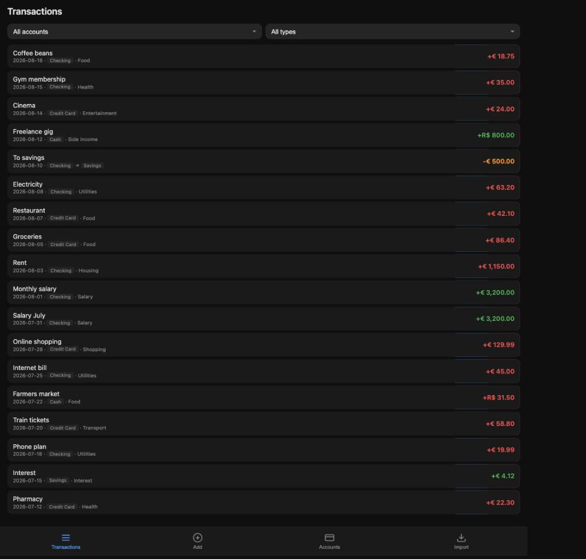
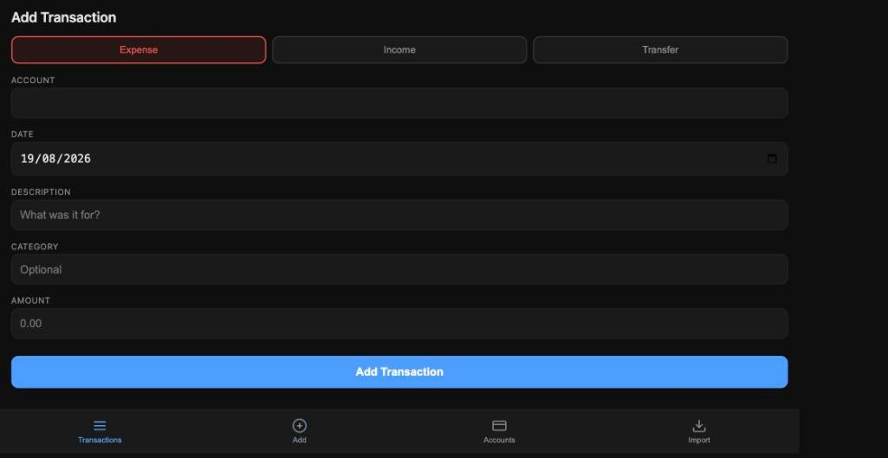
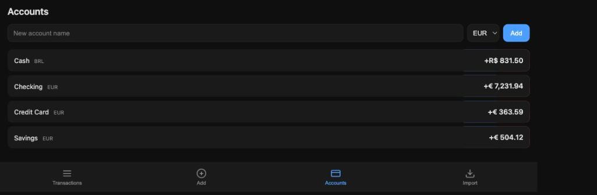

# Money Tracker

A self-hosted personal finance tracker. Mobile-first PWA frontend backed by a small Node/Express + SQLite server, with an optional scraper for migrating historical data out of [MinhasEconomias](https://www.minhaseconomias.com.br/).

> **⚠️ Note:** This project was largely built with AI assistance. It has **no authentication** — anyone who can reach the server can read and write all data. Run it **locally** (or behind a trusted private network / VPN); do **not** expose it to the public internet.

## Features

- Track **expenses**, **income**, and **transfers** across multiple accounts
- Per-account currency (EUR / BRL)
- Computed account balances (transfers debit the source and credit the destination)
- Category autocomplete from prior transactions
- CSV **import** and **export**
- Installable **PWA** with offline shell (service worker caches the app assets)
- Filter transactions by account and type, with pagination
- Swipe-to-reveal edit/delete on the transactions and accounts lists

## Screenshots

| Transactions | Add transaction | Accounts |
| :---: | :---: | :---: |
|  |  |  |

<sub>Screens shown with sample data — the app ships empty.</sub>

## Stack

- **Backend:** Node.js, [Express 5](https://expressjs.com/), [better-sqlite3](https://github.com/WiseLibs/better-sqlite3)
- **Frontend:** Vanilla JS modules, no build step — served as static files from `app/`
- **Scraper:** [Playwright](https://playwright.dev/) (Chromium) against MinhasEconomias' internal `/direct.do` API
- **Task runner:** [just](https://github.com/casey/just) (optional convenience)

## Requirements

- Node.js 18+
- For the scraper only: a working Playwright Chromium install (`npx playwright install chromium`)

## Setup

```bash
npm install
```

The SQLite database file (`data.sqlite`) is created automatically on first run and is gitignored.

**If you have `ignore-scripts=true` in your npm config** (a common hardening default), `better-sqlite3`'s prebuild step and Playwright's browser download will be silently skipped, and you'll hit `Could not locate the bindings file` / missing-browser errors. Run the install scripts explicitly once:

```bash
npm rebuild better-sqlite3 --ignore-scripts=false   # downloads / compiles the native binary
npx playwright install chromium                     # only needed if you'll run the scraper
```

## Run

```bash
npm start            # or: just serve
```

The app is then available at <http://localhost:3000>.

To stop a backgrounded server: `just stop` (uses `pkill -f "node server.js"`).

### Run as a systemd service (Linux)

For a persistent install on a Linux server, [`systemd/money-tracker.service`](systemd/money-tracker.service) runs the app under `node server.js` with `Restart=always` (auto-restart on crash, with a 5-second backoff). The unit assumes the repo is at `/home/youruser/money-tracker` and runs as user `youruser` — edit those, and the `node` path in `ExecStart=`, if your setup differs.

Manual install:

```bash
sudo cp systemd/money-tracker.service /etc/systemd/system/
sudo systemctl daemon-reload
sudo systemctl enable --now money-tracker.service

systemctl status money-tracker.service
journalctl -u money-tracker -f
```

Or via the `just` shortcuts — `just deploy` from your laptop pushes the tree via rsync, then `just systemd-install && just systemd-enable` on the server installs and activates both the app service and the backup timer in one go:

```bash
# Laptop
just deploy

# SSH in to the server, then:
cd ~/money-tracker
npm install                  # native build for Linux glibc
just systemd-install
just systemd-enable
just systemd-status
```

`just deploy` expects an SSH alias `money-tracker` in `~/.ssh/config` so the rsync target resolves:

```
Host money-tracker
    HostName <server-ip>
    User youruser
    IdentityFile ~/.ssh/id_ed25519
```

Replace `<server-ip>`, `youruser`, and the key path with your own. Note that `just deploy` rsyncs your real `.env` (login + AWS credentials) to the server — intended, but be aware.

The backup timer in [`Backups (S3)`](#backups-s3) is fully independent of the app service — the backup script reads `data.sqlite` directly, so it works whether or not the app is running. `just systemd-enable` enables the **timer** (not the .service); the .service is a oneshot that the timer triggers daily.

## Importing data

Two paths:

1. **CSV import in the UI** — open the *Import / Export* tab, pick a CSV file matching the format below, then tap **Import Data**.
2. **Scraper** (one-off historical migration from MinhasEconomias):

   ```bash
   cp .env.example .env   # then fill in ME_EMAIL and ME_PASSWORD

   npm run scrape         # or: just scrape
   ```

   This logs into MinhasEconomias, walks every month from 2017 to now, deduplicates transfer pairs, and writes `transactions.csv` to the repo root. Import it via the *Import / Export* tab in the UI.

   Note: the credential env vars are intentionally named `ME_EMAIL` / `ME_PASSWORD` rather than `USERNAME` / `PASSWORD` — zsh exports `$USERNAME` automatically, and dotenv won't override an already-set env var, so the colliding name would silently make `.env` ineffective.

### CSV format

Header row, comma-separated:

```
account,date,description,category,amount,type,consolidated,currency,to_account
```

- `date` — `YYYY-MM-DD`
- `amount` — signed decimal; expenses are negative, income positive, transfers positive (sign is enforced/normalized on import where applicable)
- `type` — `expense` | `income` | `transfer`
- `consolidated` — `yes` | `no`
- `currency` — `EUR` | `BRL` (used to seed account currency on import; not stored per transaction)
- `to_account` — destination account name for transfers, empty otherwise

## Project layout

```
.
├── server.js          # Express server + SQLite schema + REST API
├── scraper.js         # MinhasEconomias → transactions.csv (Playwright)
├── app/               # Static PWA served by server.js
│   ├── index.html
│   ├── app.js         # UI logic, navigation, swipe gestures
│   ├── db.js          # Thin fetch wrapper around the REST API
│   ├── csv.js         # CSV parse + account-name → currency inference
│   ├── style.css
│   ├── sw.js          # Service worker (cache-first)
│   ├── manifest.json
│   └── icons/
├── .justfile          # serve / stop / scrape / install shortcuts
└── package.json
```

## API

All endpoints are JSON; the server also serves the static `app/` directory.

| Method | Path                          | Purpose                                        |
| ------ | ----------------------------- | ---------------------------------------------- |
| GET    | `/api/accounts`               | List accounts                                  |
| POST   | `/api/accounts`               | Create/replace account `{ name, currency }`    |
| PUT    | `/api/accounts/:name`         | Rename and/or change currency                  |
| DELETE | `/api/accounts/:name`         | Delete account                                 |
| GET    | `/api/accounts/balances`      | Map of account → computed balance              |
| GET    | `/api/transactions`           | Paginated list; supports `account`, `type`, `limit`, `offset` |
| GET    | `/api/transactions/all`       | All transactions (used for export)             |
| GET    | `/api/transactions/:id`       | Single transaction                             |
| POST   | `/api/transactions`           | Create                                         |
| PUT    | `/api/transactions/:id`       | Update                                         |
| DELETE | `/api/transactions/:id`       | Delete                                         |
| GET    | `/api/categories`             | Distinct categories ever used                  |
| POST   | `/api/import`                 | Bulk insert `{ transactions, currencyMap }`    |
| POST   | `/api/clear`                  | Wipe all accounts and transactions             |

## Backups (S3)

A daily backup script (`backup.js`) reads `data.sqlite` directly, builds the same CSV the UI export produces, and uploads it to S3 as `s3://<bucket>/<prefix>/money-tracker-YYYY-MM-DD.csv`.

### 1. Provision the AWS resources (OpenTofu)

The IaC lives in [`tofu/`](tofu/) and provisions:

- a versioned, AES256-encrypted, public-access-blocked S3 bucket;
- an IAM user whose **only** permission is `s3:PutObject` on objects matching `<prefix>/money-tracker-*.csv` in that one bucket — no list, no read, no delete, no access to anything else;
- an access key for that user.

#### Operator IAM user (one-time, AWS console)

The IaC needs an AWS principal to run as — this is a **different** user from the restricted backup user it will create. Set it up once in the AWS console:

1. IAM → **Users** → **Create user**. Name it `money-tracker-iam` (or whatever you like, e.g. `money-tracker-tofu-operator`). No console access — programmatic only.
2. Attach this **inline policy** to the user. It grants exactly the S3 and IAM actions Tofu needs to manage *our* bucket and *our* backup user — nothing else in the account. If you change `bucket_name` or `iam_user_name` in `terraform.tfvars`, update the matching ARNs here.

   ```json
   {
     "Version": "2012-10-17",
     "Statement": [
       {
         "Sid": "WhoAmI",
         "Effect": "Allow",
         "Action": "sts:GetCallerIdentity",
         "Resource": "*"
       },
       {
         "Sid": "ManageBackupBucket",
         "Effect": "Allow",
         "Action": [
           "s3:CreateBucket",
           "s3:DeleteBucket",
           "s3:GetBucketLocation",
           "s3:GetBucketTagging",
           "s3:PutBucketTagging",
           "s3:GetBucketVersioning",
           "s3:PutBucketVersioning",
           "s3:GetEncryptionConfiguration",
           "s3:PutEncryptionConfiguration",
           "s3:GetBucketPublicAccessBlock",
           "s3:PutBucketPublicAccessBlock",
           "s3:GetBucketAcl",
           "s3:GetBucketCORS",
           "s3:GetBucketWebsite",
           "s3:GetBucketLogging",
           "s3:GetLifecycleConfiguration",
           "s3:GetReplicationConfiguration",
           "s3:GetBucketObjectLockConfiguration",
           "s3:GetBucketRequestPayment",
           "s3:GetAccelerateConfiguration",
           "s3:GetBucketPolicy",
           "s3:GetBucketOwnershipControls",
           "s3:ListBucket"
         ],
         "Resource": "arn:aws:s3:::money-tracker-backup"
       },
       {
         "Sid": "ManageBackupIamUser",
         "Effect": "Allow",
         "Action": [
           "iam:CreateUser",
           "iam:DeleteUser",
           "iam:GetUser",
           "iam:TagUser",
           "iam:UntagUser",
           "iam:ListUserTags",
           "iam:ListUserPolicies",
           "iam:ListAttachedUserPolicies",
           "iam:ListGroupsForUser",
           "iam:PutUserPolicy",
           "iam:GetUserPolicy",
           "iam:DeleteUserPolicy",
           "iam:CreateAccessKey",
           "iam:DeleteAccessKey",
           "iam:ListAccessKeys",
           "iam:UpdateAccessKey",
           "iam:GetAccessKeyLastUsed"
         ],
         "Resource": "arn:aws:iam::*:user/money-tracker-backup"
       }
     ]
   }
   ```

3. Create an access key for this user and add a profile to `~/.aws/credentials`:

   ```ini
   [money-tracker]
   aws_access_key_id     = AKIA...
   aws_secret_access_key = ...
   region                = eu-central-1
   ```

   The `just tofu-*` recipes (and the commands below) prefix every call with `AWS_PROFILE=money-tracker`, so this profile name has to match.

#### Run OpenTofu

```bash
cd tofu
cp terraform.tfvars.example terraform.tfvars
# Edit terraform.tfvars and set `bucket_name` to something globally unique.

tofu init                              # pins the AWS provider and writes .terraform.lock.hcl (commit it)
tofu fmt -check -recursive             # formatting check (no AWS call)
tofu validate                          # config validity check (no AWS call)
tofu plan
tofu apply
```

Or from the project root via `just`: `just tofu-init`, `just tofu-fmt`, `just tofu-validate`, `just tofu-plan`, `just tofu-apply` — each one runs with `AWS_PROFILE=money-tracker` baked in.

Commit `tofu/.terraform.lock.hcl` after the first `tofu init` so future plans reuse the exact same provider version.

After apply, pull the credentials out of the state into `.env`:

```bash
# Prints the AWS_* lines to copy into .env (secret stays hidden — fetch separately).
tofu output env_file_snippet

# Print just the secret once, so you can paste it as AWS_SECRET_ACCESS_KEY.
tofu output -raw aws_secret_access_key
```

> The state file (`tofu/terraform.tfstate`) contains the IAM secret in plaintext and is gitignored. If you ever share this repo, keep state local or move it to an encrypted remote backend (S3 + DynamoDB, or `tofu` cloud).

For reference, this is the exact IAM policy the IaC attaches — note the wildcard is scoped to the backup filename pattern, so the user can't write arbitrary objects:

```json
{
  "Version": "2012-10-17",
  "Statement": [{
    "Sid": "AllowDailyCsvBackupOnly",
    "Effect": "Allow",
    "Action": "s3:PutObject",
    "Resource": "arn:aws:s3:::YOUR-BUCKET/backups/money-tracker-*.csv"
  }]
}
```

### 2. Fill in `.env`

```
AWS_ACCESS_KEY_ID=AKIA...        # from `tofu output aws_access_key_id`
AWS_SECRET_ACCESS_KEY=...        # from `tofu output -raw aws_secret_access_key`
AWS_REGION=eu-central-1          # match var.aws_region
AWS_S3_BUCKET=your-money-tracker-backups
AWS_S3_PREFIX=backups
```

### 3. Install the AWS SDK and test it

```bash
npm install
npm run backup
```

You should see something like:

```
[2026-05-18T03:00:00.123Z] Backup uploaded: s3://your-money-tracker-backups/backups/money-tracker-2026-05-18.csv (1234 transactions, 287654 bytes)
```

Verify in the S3 console that the object appeared.

### 4. Schedule it daily (Linux `systemd` timer)

The unit files live in `systemd/` in this repo:

- [`systemd/money-tracker-backup.service`](systemd/money-tracker-backup.service) — runs `node backup.js` as a oneshot, loading credentials from `.env` via `EnvironmentFile=`.
- [`systemd/money-tracker-backup.timer`](systemd/money-tracker-backup.timer) — daily at 03:00, with `Persistent=true` so a missed run (server off at 03:00) fires when the machine is back up.

They assume the app lives at `/home/youruser/money-tracker` and runs as user `youruser`, and that `node` is at `/usr/bin/node`. If any of that differs, edit the units before installing — systemd does not load login shells, so PATH lookups won't find nvm-managed binaries; use `which node` and put the absolute path in `ExecStart=`.

Install and enable:

```bash
sudo cp systemd/money-tracker-backup.service systemd/money-tracker-backup.timer /etc/systemd/system/
sudo systemctl daemon-reload
sudo systemctl enable --now money-tracker-backup.timer
```

Verify and inspect:

```bash
# When does it fire next?
systemctl list-timers money-tracker-backup.timer

# Run it now (smoke test) without waiting for the timer
sudo systemctl start money-tracker-backup.service

# Logs (live tail or scoped to the last run)
journalctl -u money-tracker-backup.service -f
journalctl -u money-tracker-backup.service --since "1 hour ago"
```

> If your distro doesn't use systemd, the cron equivalent (as the app's user) is:
> `0 3 * * * cd /home/youruser/money-tracker && /usr/bin/node backup.js >> backup.log 2>&1`

## Notes

- The schema is defined inline in `server.js` and runs on every start, so the DB is created on first run.
- Foreign keys are intentionally off — account names are denormalized onto each transaction so renaming an account requires the `PUT /api/accounts/:name` flow, which updates every referencing row in a transaction.
- The service worker (`app/sw.js`) caches the app shell under `money-tracker-v1`. Bump the cache name when changing cached assets to force clients to refresh.
- There is currently no auth — run this only on `localhost` or behind a trusted network/tunnel.
